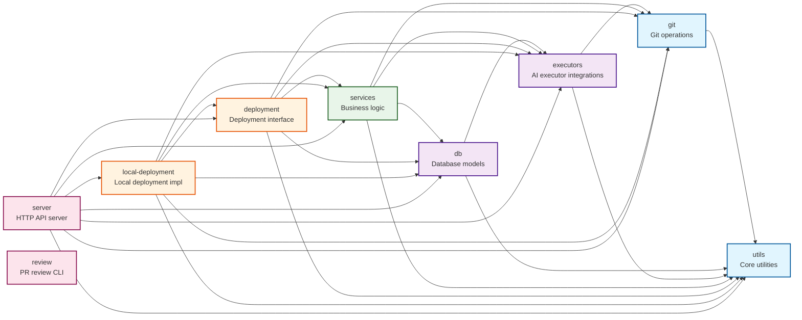

# Vibe Kanban Architecture: Crate Dependency Structure

## System Design Overview

## Key Orchestration Features

**Container Service - Core Orchestration Engine**: The ContainerService (in `crates/services/src/services/container.rs`, 1317 lines) is the primary orchestration engine. It manages the complete lifecycle of agent executions through these key responsibilities: (1) validates pre-execution conditions and checks for running processes, (2) creates ExecutionProcess database records with before/after commit tracking, (3) spawns agent processes in tokio tasks and creates MsgStore instances to capture all stdout/stderr output, (4) streams stdout/stderr to MsgStore as they arrive from the agent process in real-time, (5) persists stdout/stderr logs to database (ExecutionProcessLogs table) via background tokio task, (6) provides streaming endpoints (stream_raw_logs, stream_normalized_logs) that serve stdout/stderr to WebSocket clients, (7) monitors process exit and updates database status, (8) handles finalization logic including git commits and execution chaining, (9) manages cleanup of orphaned processes on server restart, (10) coordinates worktree creation and cleanup, (11) sends desktop notifications on completion. This single service orchestrates all interactions between server routes, deployment services, executors, database, and git operations.

**Execution Chaining**: The system supports sequential execution chains where a setup script runs first, followed by the main coding agent, then optional cleanup and archive scripts. Each execution in the chain is tracked separately in the database with its own ExecutionProcess record. The next_action field in each ExecutionProcess determines what runs after completion.

**Parallel Dev Servers**: Dev servers (npm start, cargo run, etc.) can run in parallel with coding agent executions. They are marked with run_reason = DevServer and remain running indefinitely until explicitly stopped, while regular executions complete and trigger the next action in the chain.

**Queued Messages**: When an agent is busy executing, new user messages are queued in the database rather than rejected. The QueuedMessageService (in `crates/services/src/services/queued_message.rs`) holds messages in an in-memory DashMap keyed by session_id. When a user sends a follow-up message while an execution is running, the frontend calls POST `/api/sessions/:session_id/queue` which stores the message (prompt + executor_profile_id) with a timestamp. The container service does not automatically consume queued messages; instead, the frontend polls GET `/api/sessions/:session_id/queue` to check queue status and manually triggers a new execution request once the current one completes. The QueuedMessageService provides queue_message() to store, take_queued() to consume and remove, cancel_queued() to delete, and get_status() to check if a message is waiting. This prevents message loss and maintains conversation continuity when agents are busy.

**Retry Mechanisms**: The system does not retry failed agent executions automatically. However, specific operations use retry logic: (1) Remote API calls in RemoteClient use exponential backoff retry via the backon crate, retrying on transient network errors with configurable delays; (2) Git worktree creation in WorktreeManager retries once on metadata conflicts, cleaning up stale git metadata before the second attempt; (3) Git host operations (GitHub/Azure DevOps API calls) use exponential backoff retry for rate limiting and transient failures. Agent execution failures are marked as Failed status and require manual re-execution by the user. The frontend can check execution status and offer retry buttons, but the retry is a new execution request, not an automatic retry within the same execution process.

**Git Worktree Isolation**: Each task gets its own git worktree on a unique branch. The WorktreeManager service creates worktrees, manages branch naming with task IDs, and ensures cleanup when tasks complete. This isolation prevents concurrent agents from interfering with each other's file changes. The worktree path (container_ref) is stored in the database and used by agents to know their working directory.

**Container Reference Resolution**: The containers.rs route provides endpoints for resolving container references (worktree paths) back to their workspace/task/project context. The `/containers/info` endpoint takes a container_ref (worktree path) and returns the associated project_id, task_id, and workspace_id. This is critical for VSCode extensions and CLI tools that operate inside worktrees and need to report back their context to the server. The `/containers/attempt-context` endpoint provides full workspace context including repository configurations.

**Before/After Commit Tracking**: Every execution captures the HEAD commit of each repository before starting (stored in ExecutionProcessRepoState). After completion, it captures the new HEAD commit. This enables computing diffs showing exactly what the agent changed, supports rollback scenarios, and provides audit trails.

**Automatic Git Commits**: When an execution completes successfully with uncommitted changes, the container service automatically stages all changes and creates a commit. Commit messages are generated based on the task description and execution context.

**Real-time Log Streaming**: The container service orchestrates all log streaming functionality. When spawning an execution, it creates a new MsgStore instance and registers it in the shared msg_stores HashMap (Arc<RwLock<HashMap<Uuid, Arc<MsgStore>>>>) accessible to all service methods. The container service passes this MsgStore to the executor, which writes all agent stdout/stderr chunks as LogMsg::Stdout and LogMsg::Stderr entries. The container service spawns a background tokio task (spawn_stream_raw_logs_to_db) that subscribes to the MsgStore's broadcast channel and persists entries to the ExecutionProcessLogs database table as JSONL lines. When clients request logs, the container service provides two streaming methods: stream_raw_logs retrieves the MsgStore by execution_id and returns a BoxStream of stdout/stderr entries, while stream_normalized_logs processes and normalizes the output for structured display. These methods power the WebSocket endpoints that serve logs to the frontend. After execution completes, the container service removes the MsgStore from the HashMap during finalization, freeing memory while preserving database records for historical access.

**Execution State Machine**: The container service enforces all state transitions. Before starting an execution, it queries the database via has_running_processes to check if any ExecutionProcess records exist with status = Running for the target workspace, rejecting new requests if conflicts are found. When calling start_execution, it creates the ExecutionProcess record with status = Running. The container service spawns a tokio task in start_execution_inner that wraps the executor run and monitors process completion. When the process exits, this task calls ExecutionProcess::update_completion with the appropriate status (Completed for exit code 0, Failed otherwise). For stop requests, the container service's try_stop method queries running processes, sends kill signals, and updates their status to Killed. The container service's finalize method inspects the final status to determine next actions: Completed triggers should_finalize checks, automatic git commits, and execution chaining via recursive start_execution calls; Failed skips commits but still finalizes; Killed skips both commits and notifications. Status is the single source of truth that drives all orchestration decisions.

## Process Status Checking

**No Active Polling**: The system does not poll process status. Status tracking is event-driven based on the tokio task that spawns the agent process.

**Database as Source of Truth**: ExecutionProcess records in SQLite store the current status. When clients query status, they fetch the ExecutionProcess record by ID and read its status field directly from the database.

**Process Exit Detection**: The tokio task that spawns the agent process awaits the process completion. When the OS reports process exit, the task immediately updates the ExecutionProcess status in the database with the exit code and final status (Completed if exit code 0, Failed otherwise).

**Running Process Queries**: To check if a workspace has running processes, the container service queries ExecutionProcess records with status = Running for that workspace. This query filters out dev servers when checking for conflicts before starting new executions.

**Process Kill Mechanism**: Stop requests lookup running ExecutionProcess records, extract stored process IDs, and send OS termination signals via utils shell execution. The tokio task detects the signal-induced exit and updates status to Killed in the database.

**WebSocket Connection State**: For real-time log streaming, clients (frontend React app) maintain WebSocket connections to the server's log streaming endpoint at `/api/logs/:execution_id`. The connection remains open while the execution is running. When the execution completes, the MsgStore sends a "Finished" message and closes the stream, signaling completion to the client.

**Server-Sent Events for Status**: The EventService broadcasts execution lifecycle events (started, completed, failed, killed) via SSE connections between the frontend and the server's `/api/events` endpoint. Clients (frontend React app) subscribe to events for specific workspaces or tasks and receive push notifications when status changes occur, eliminating the need for polling. SSE is unidirectional (server to client only) and allows the server to push multiple events over a single long-lived HTTP connection.

**Historical Status**: Completed executions remain in the database indefinitely with their final status. Clients can query historical ExecutionProcess records to see past execution results, exit codes, timestamps, and associated repo state commits.

## Request Execution Flow

When a request arrives at the server to execute an AI agent task, the system follows this sequence:

**1. HTTP Request Reception (server)**
The Axum server receives the request at a route handler in `task_attempts.rs`. Middleware loads the workspace context from the database using the workspace ID from the request path. The handler validates that the workspace exists and belongs to an active task.

**2. Deployment Layer Access (server → deployment → local-deployment)**
The server obtains the deployment implementation through dependency injection. The handler calls methods on the deployment trait, which local-deployment implements. Local-deployment provides references to all service instances that were initialized at startup and stored in Arc-wrapped structures for concurrent access.

**3. Pre-execution Validation (services)**
The container service checks if any non-dev-server execution processes are already running for this workspace by querying the database. If an execution is already running, the request is rejected to prevent concurrent modifications to the same worktree. The service verifies that the workspace has a container_ref pointing to a valid git worktree on disk.

**4. Session and Execution Process Creation (services → db)**
The container service creates a new session record in the database if one doesn't exist for this workspace. It then creates an ExecutionProcess record with status "Running". Before creating this record, the service captures the current HEAD commit for each repository in the workspace by calling git operations. These "before" commits are stored in ExecutionProcessRepoState records, establishing a baseline for detecting what changes the agent makes.

**5. Executor Profile Selection (services → executors)**
The system loads the executor configuration from JSON profiles that define how to invoke each AI agent (Claude Code, Cursor, GitHub Copilot, etc.). The executor profile specifies the command to run, working directory setup, environment variables, and whether the agent supports MCP (Model Context Protocol). If the profile includes setup scripts, those are configured to run before the main agent execution.

**6. Message Store Initialization (services)**
The container service creates a new MsgStore for this execution and registers it in a shared HashMap keyed by execution process ID. This store captures all stdout, stderr, and structured log messages from the agent execution, allowing clients to stream logs via WebSocket or SSE connections. The store maintains an in-memory buffer and optionally persists to disk for historical access.

**7. Agent Process Spawn (services → executors → utils)**
The container service spawns a new tokio task that will run the agent. Within this task, it invokes the executor with the ExecutorAction describing what to do (script execution or coding agent interaction). The executor constructs a command using the profile configuration, sets up the working directory inside the worktree, and uses utils shell execution to spawn the process. Process stdout and stderr are captured and streamed to the MsgStore as they arrive.

**8. Real-time Log Streaming (services)**
As the agent executes, clients can connect to WebSocket or SSE endpoints to receive real-time log updates. The server retrieves the MsgStore by execution process ID and streams its contents. The MsgStore maintains an internal broadcast channel that notifies all subscribers when new log entries arrive. Clients receive LogMsg entries containing stdout chunks, stderr chunks, or structured events like "execution started" or "execution finished".

**9. Execution Monitoring and Status Checks (services → db)**
The system does not poll for execution status. Instead, the spawned tokio task monitors the agent process directly. When the process exits, the task captures the exit code and updates the ExecutionProcess record in the database with the final status (Completed, Failed, or Killed). The task also captures the "after" HEAD commit for each repository and stores it in the ExecutionProcessRepoState records. During execution, clients query the database to check current status by fetching the ExecutionProcess record.

**10. Post-execution Finalization (services → git → db)**
When the agent completes, the container service's finalization logic runs. This examines the exit code and ExecutionProcess configuration to determine if changes should be committed. If the execution succeeded and left uncommitted changes, the service uses git operations to stage all changes and create a commit with a generated message. The service then checks if the ExecutionProcess has a next_action configured (for execution chains like setup → coding agent → cleanup). If so, it recursively calls start_execution with the next action. If no next action exists and this wasn't a dev server, the finalization marks the workspace as complete.

**11. Cleanup and Notification (services)**
After finalization, the container service removes the MsgStore from the shared HashMap to free memory. If notification services are configured, desktop notifications are sent to inform the user of completion. Event services broadcast completion events to all connected SSE clients. The database retains the ExecutionProcess and ExecutionProcessRepoState records for historical tracking and diff computation.

**12. Status Query Requests (server → services → db)**
Separate HTTP requests can query execution status at any time. These handlers fetch the ExecutionProcess record from the database and return its current status field. For dev server processes (run_reason = DevServer), the status remains "Running" indefinitely until explicitly stopped. For other processes, the status reflects whether the agent process is still executing, has completed successfully, or has failed.

**13. Stop/Kill Requests (server → services → utils)**
When a stop request arrives, the server calls the container service's try_stop method. This retrieves all running ExecutionProcess records for the workspace from the database. For each one, it attempts to kill the underlying process using the process ID stored during spawn. The utils shell execution utilities send termination signals to the processes. The ExecutionProcess records are updated to status "Killed". If the process was running in a tokio task, that task detects the process exit and completes its finalization logic, though it skips git commits when status is Killed.

## Architecture Summary

The system's overall architecture achieves its goals of enabling safe concurrent AI agent execution while maintaining operational flexibility. The layered design with strict dependency management ensures that changes remain localized, while the trait-based deployment abstraction provides a clear path toward supporting additional execution environments. The comprehensive state tracking throughout execution lifecycles enables robust error recovery and provides the observability necessary for debugging complex multi-agent interactions.
