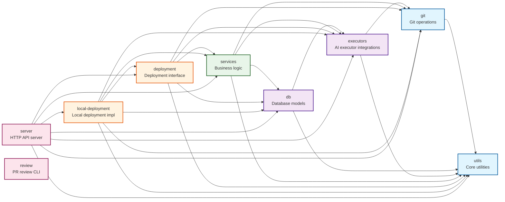

# Vibe Kanban Architecture: Crate Dependency Structure

## System Design Overview

The Vibe Kanban backend is architected as a layered system that enables AI coding agents to execute software development tasks in isolated, version-controlled environments. The design philosophy prioritizes three core tenets: execution isolation through git worktrees, deployment flexibility through trait abstraction, and operational safety through comprehensive state tracking. This architecture emerged from the fundamental constraint that multiple concurrent AI agents must operate on the same repository without interference, while maintaining the ability to merge their work back into mainline branches.

At its foundation, the system recognizes that AI coding agents are fundamentally different from traditional automation. They require long-running execution contexts, bidirectional streaming communication, and the ability to invoke arbitrary tooling within sandboxed environments. Unlike conventional microservices architectures that emphasize stateless request handling, this system embraces stateful execution contexts that persist across multiple interactions, capturing the full conversation history and filesystem state at each step.

The dependency graph follows a strict acyclic pattern where lower layers provide primitives that higher layers compose into increasingly sophisticated behaviors. This design prevents circular dependencies while enabling clear separation of concerns. The core layer provides essential primitives for shell execution, git operations, and path manipulation without depending on any application-specific logic. Above this, the data layer introduces persistence and AI agent integration profiles. The services layer then orchestrates these capabilities into cohesive business operations, while the deployment layer abstracts the execution environment to support both local desktop applications and future cloud-hosted deployments.

## Core Layer: Foundation Primitives

The utils crate establishes the foundational primitives upon which all higher-level operations depend. Its design reflects a deliberate choice to minimize external dependencies while providing robust implementations of common operations. The shell execution utilities embrace asynchronous operation exclusively, rejecting synchronous variants to prevent blocking the tokio runtime. This decision cascades through the entire system, ensuring that long-running git operations or file system traversals never stall concurrent executions.

The diff engine within utils represents a particularly critical component, as it enables the system to understand and apply code changes without relying on external patch utilities. This independence from platform-specific tooling ensures consistent behavior across Windows, macOS, and Linux environments. The implementation handles unified diff format parsing, application with conflict detection, and line change attribution, which higher layers leverage for presenting changes to users and detecting when AI agents have modified specific code regions.

The git crate builds upon utils to provide a comprehensive wrapper around git operations. Rather than embedding libgit2 throughout the codebase, this crate centralizes all git interactions behind a clean interface. The hybrid approach of using libgit2 for read operations and CLI invocations for writes balances performance with safety. Read operations benefit from libgit2's speed and in-process execution, while write operations use the git CLI to ensure compatibility with git hooks, credential helpers, and other ecosystem tooling that users expect to function correctly.

## Data Layer: Persistence and Agent Integration

The database crate implements a SQLite-based persistence layer with explicit migration management. The choice of SQLite over client-server databases reflects the local-first design philosophy, where each deployment manages its own database without requiring external infrastructure. The schema design captures three primary domains: project organization including repositories and their metadata, execution tracking with before-and-after commit information for each agent run, and workspace isolation where each task receives its own git worktree and configuration.

Migration management follows a linear versioning scheme where each migration is identified by a sequential number and timestamp. This approach ensures deterministic database evolution across different installations while allowing developers to reason about schema changes chronologically. The models layer provides strongly-typed Rust structs that map to database tables using SQLx's compile-time query verification, catching SQL errors during compilation rather than at runtime.

The executors crate defines the integration layer with various AI coding agents. Rather than hardcoding support for specific agents, the design uses a profile-based system where each agent is described through a JSON configuration specifying its invocation method, capability set, and communication protocol. This extensibility allows new agents to be integrated by adding configuration files rather than modifying code. The crate standardizes on a common action vocabulary including script execution, coding agent interactions, and approval workflows, which the services layer orchestrates into complex execution chains.

The Model Context Protocol integration within executors represents a forward-looking design decision that anticipates a future where AI agents standardize on common communication protocols. By supporting MCP alongside proprietary agent formats, the system positions itself to interoperate with an emerging ecosystem of AI development tools.

## Services Layer: Business Logic Orchestration

The services crate implements the core business logic that transforms low-level primitives into cohesive workflows. The container service serves as the primary orchestration engine, managing the complete lifecycle of agent executions from initialization through cleanup. Its design recognizes that executions form chains where setup scripts prepare environments, coding agents perform work, and cleanup scripts handle teardown. The state machine that governs execution lifecycle includes provisions for parallel execution of dev servers alongside primary agents, queued message handling when agents are busy, and automatic retry logic when executions fail.

The worktree manager service encapsulates the complexity of git worktree operations, which provide the isolation mechanism that allows concurrent executions. Each task receives its own worktree pointing to a unique branch, ensuring that changes made by one agent cannot interfere with another. The manager handles worktree creation, branch management, and cleanup, while tracking which worktrees are active and enforcing limits on concurrent executions per repository.

The filesystem service provides cached repository discovery, intelligent file search with ranking based on git activity patterns, and streaming file content delivery. Its design reflects the reality that modern repositories can contain tens of thousands of files, making naive directory traversal prohibitively expensive. The caching strategy tracks which directories have been scanned and invalidates caches when file system watcher events indicate changes, balancing freshness with performance.

Event streaming through the events service enables real-time UI updates using Server-Sent Events. Rather than forcing clients to poll for status changes, the system pushes notifications when executions start, produce output, or complete. The service maintains per-client subscription sets, allowing fine-grained control over which events each connected client receives.

The PR monitoring service demonstrates the system's integration with external platforms. It periodically polls GitHub and Azure DevOps for pull request updates, detecting when PRs are merged, commented on, or closed. This information feeds back into the task management system, allowing the UI to reflect the current state of code review processes without manual status updates.

## Deployment Layer: Environment Abstraction

The deployment crate defines a trait that abstracts the execution environment, enabling the same core logic to run in different contexts. This abstraction recognizes that local desktop deployments have fundamentally different requirements from cloud-hosted environments. Local deployments need PTY support for interactive terminal sessions, filesystem access for browsing local repositories, and native OAuth credential storage. Cloud deployments require multi-tenancy, API-based authentication, and containerized isolation.

The trait design provides access to all system services through a common interface, allowing the server layer to remain agnostic about deployment details. Methods on the deployment trait return references to service instances, enabling shared ownership patterns where multiple concurrent requests access the same service objects. The trait also defines lifecycle hooks for Sentry scope configuration and analytics event tracking, ensuring that observability remains consistent across deployment types.

The local-deployment crate implements the deployment trait for standalone desktop applications. It manages configuration persistence to the local filesystem, generates stable user identifiers for analytics, and handles OAuth credential handoff from the system browser back to the application. The implementation instantiates all service objects during initialization and maintains them in Arc-wrapped structures to support concurrent access.

## Entry Points: Server and Review

The server crate implements an Axum-based HTTP API that exposes the system's capabilities through REST endpoints and WebSocket connections. Its design embraces the hexagonal architecture pattern where the HTTP layer serves as an adapter translating web requests into domain operations. Route handlers remain thin, primarily validating input and delegating to services layer methods. The extensive use of middleware for workspace loading, authentication checks, and error handling keeps cross-cutting concerns separated from business logic.

Port management in the server reflects a pragmatic approach to local deployment, where the server attempts to bind to a configured port but falls back to an OS-assigned port if unavailable. This flexibility prevents conflicts when multiple instances run concurrently during development. The server writes its actual port to a well-known file location, allowing the frontend to discover the backend URL dynamically.

The review crate implements a standalone CLI tool for pull request review workflows. Its separation from the main server binary reflects a architectural decision to support batch operations that don't require the full server infrastructure. The tool uploads code contexts to a remote API, polls for AI-generated review completion, and presents results in a terminal-friendly format. This design enables integration with CI/CD pipelines where spinning up the full local deployment stack would be unnecessarily heavyweight.

The system's overall architecture achieves its goals of enabling safe concurrent AI agent execution while maintaining operational flexibility. The layered design with strict dependency management ensures that changes remain localized, while the trait-based deployment abstraction provides a clear path toward supporting additional execution environments. The comprehensive state tracking throughout execution lifecycles enables robust error recovery and provides the observability necessary for debugging complex multi-agent interactions.
