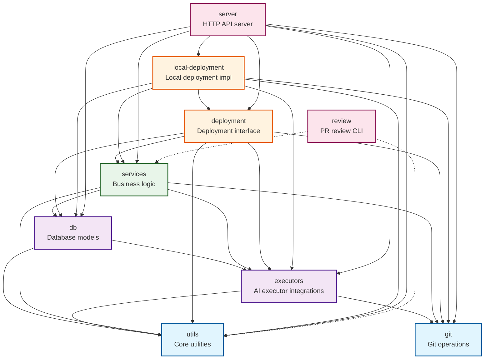

```mermaid
graph TD
    %% Core packages (no dependencies on other workspace crates)
    utils[utils<br/>Core utilities]
    git[git<br/>Git operations]
  
    %% Database layer
    db[db<br/>Database models]
  
    %% Executors
    executors[executors<br/>AI executor integrations]
  
    %% Services layer
    services[services<br/>Business logic]
  
    %% Deployment abstraction
    deployment[deployment<br/>Deployment interface]
  
    %% Deployment implementations
    local_deployment[local-deployment<br/>Local deployment impl]
  
    %% API server
    server[server<br/>HTTP API server]
  
    %% CLI tools
    review[review<br/>PR review CLI]
  
    %% Dependencies
    db --> utils
    db --> executors
  
    executors --> utils
    executors --> git
  
    services --> utils
    services --> git
    services --> executors
    services --> db
  
    deployment --> db
    deployment --> utils
    deployment --> git
    deployment --> services
    deployment --> executors
  
    local_deployment --> db
    local_deployment --> utils
    local_deployment --> git
    local_deployment --> executors
    local_deployment --> deployment
    local_deployment --> services
  
  server --> deployment
  server --> executors
  server --> local_deployment
  server --> utils
  server --> git
  server --> db
  server --> services
  
  review -.-> services
  review -.-> utils
  
  %% Styling
  classDef corePackage fill:#e1f5fe,stroke:#01579b,stroke-width:2px
  classDef dataPackage fill:#f3e5f5,stroke:#4a148c,stroke-width:2px
  classDef servicePackage fill:#e8f5e9,stroke:#1b5e20,stroke-width:2px
  classDef deployPackage fill:#fff3e0,stroke:#e65100,stroke-width:2px
  classDef serverPackage fill:#fce4ec,stroke:#880e4f,stroke-width:2px
  
  class utils,git corePackage
  class db,executors dataPackage
  class services servicePackage
  class deployment,local_deployment deployPackage
  class server,review serverPackage
```
